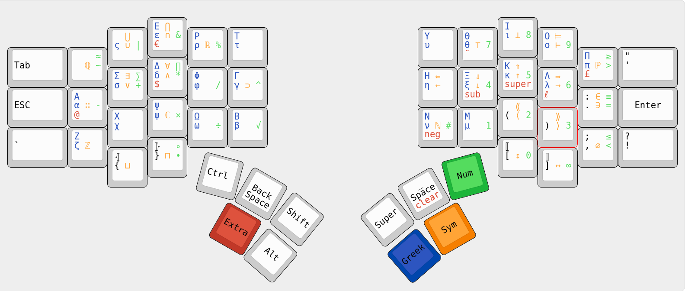

# Split keyboard firmware

## About

- Full N-Key Rollover
- Direct wired, no matrix which means no ghosting or jamming
- No debounce delay
- Full speed USB polling rate (1000Hz)
- No boot protocol support, this means it may not work in your bios
- Tested on Linux, don't know if it works with other OSs.

## Configuration

As it is the firmware supports MKL26Z64 MCUs with a 16MHz external
oscillator. With small modifications it can be made to work with other KL26
family units.

It works on two keyboard halves with 25 keys each.

GPIO pins can be defined as numbers in pins.s and mapped to keycodes in
keymap.s

Out of the box it works with a Teensy-LC.

## How to use

You need the gnu binutils for arm targets and make.

The makefile can be used to create binaries to flash each keyboard half. The
left half should be connected by USB to the host. Connect Vcc and GND of the
right and left together for power and connect the right `UART0_TX` to the left
`UART0_RX` so that keypresses can be communicated across.

Wire GPIO pins through the keyswitches and directly to ground.

See also [here](https://github.com/l4u/dactyl-manuform-mini-keyboard) and
[here](https://github.com/lebastaq/dactyl-manuform-mini-keyboard).

Open an issue if you need help.

## Layout

layout.xkb looks like this:

The latin alphabet, although not shown above, is also there in the common
qwerty arrangement when no modifiers are pressed.

The extra modifiers neg, sub and super allow negating certain characters,
subscripts and superscripts respectively.
Negated ≈ for example becomes ≉ and space becomes ¬. neg is latched when
Extra+neg is pressed, sub and super are locked; use Extra+clear to return to
normal.

This layout is not final, suggestions for improvements are very welcome.

